# What is a microcontroller?

The easiest way to understand what is a microcontroller is to think about a tiny computer: it includes a processor, memory and input/output (I/O) peripherials to connect small display, buttons, motors, sensors, etc. 
To "control" a microcontroller, you can put programs onto it and run them. As we will see later in this lesson, we usually write programs using a laptop and then transfer the programs into the microcontroller to execute it.

A microcontroller can look like this:

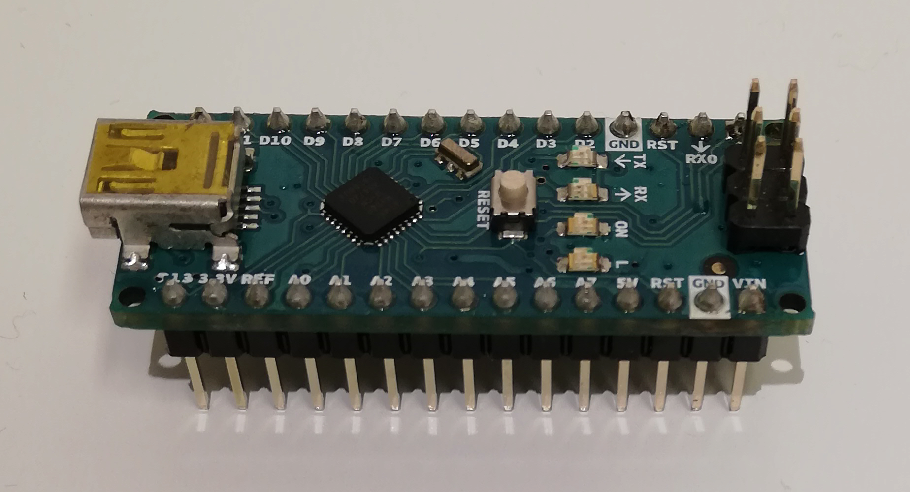

i.e. very much like what we call an "_integrated circuit_". 

Look for instance at what we see when we zoom in the previous picture:

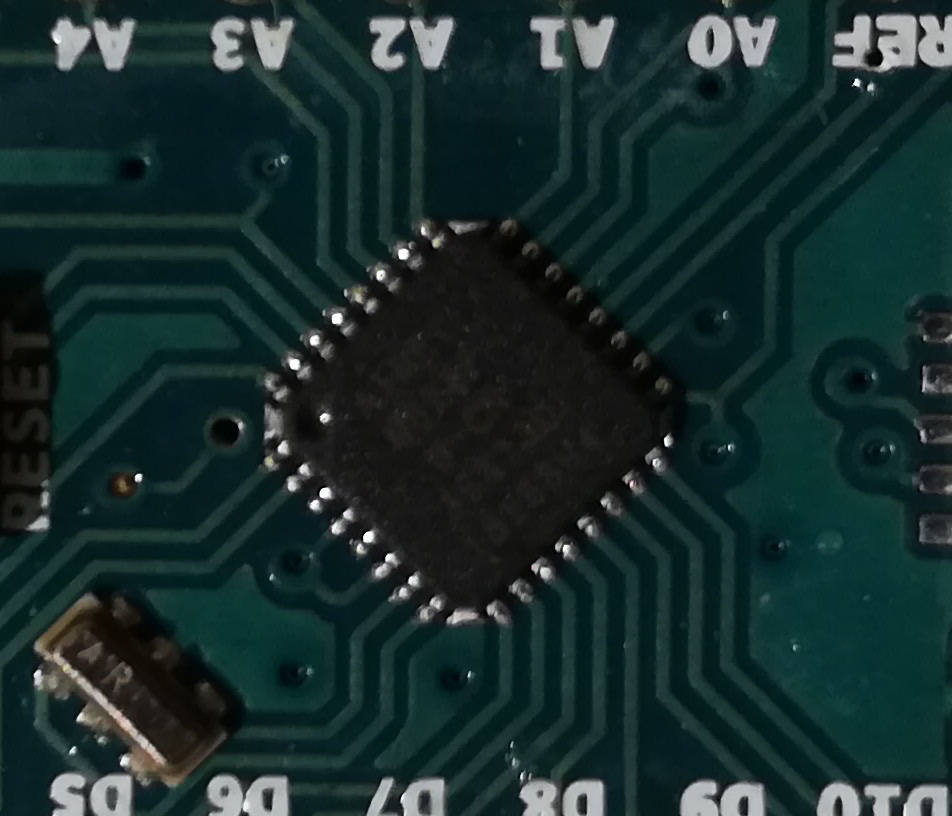

A typical microcontroller includes a processor, memory and input/output (I/O) peripherals.

# What is an Arduino Nano?

## Arduino Nano architecture

An Arduino Nano is a very tiny and simple microcontroller:
- Microcontroller: 	ATmega328
- Operating Voltage:	5 V
- Flash Memory:	32 KB of which 2 KB used by bootloader
- SRAM:	2 KB (Static Random Access Memory)
- Clock Speed:	16 MHz
- Analog IN Pins:	8 (10 bits of resolution, from ground to 5 volts)
- EEPROM:	1 KB (Electrically Erasable Programmable Read-Only Memory)
- Digital I/O Pins:	22 (6 of which are PWM)
- PWM Output:	6 (Pulse with Modulation)
- Power Consumption: 19 mA

_Source_: [https://store.arduino.cc/arduino-nano](https://store.arduino.cc/arduino-nano)

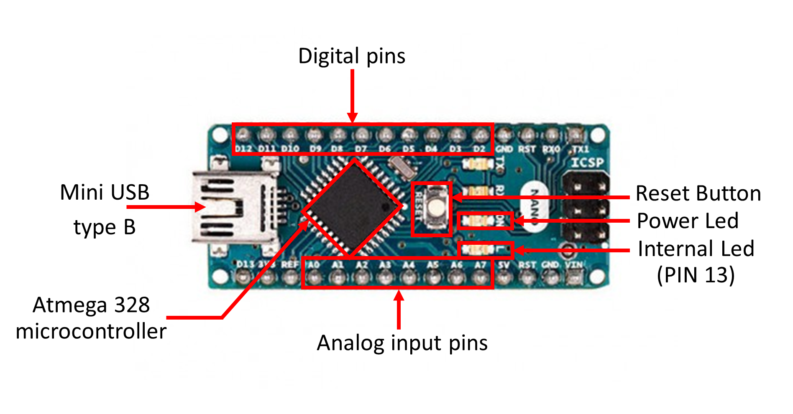

On the picture above, the Arduino Nano block is where the processor and memory are located. The rest ensures communication with external sensors, USB port, voltage regulator, etc.

For those interested in computer architecture, have a look at the functional diagram of an Arduino Nano:

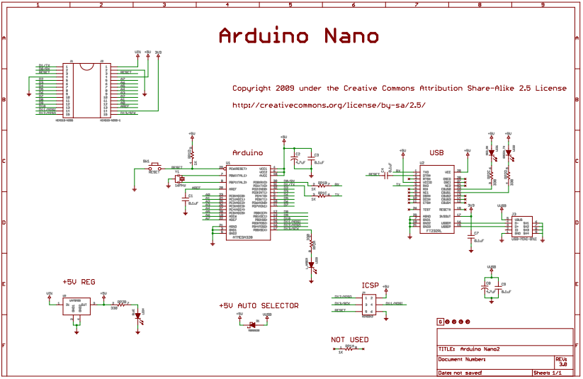

*Source*: [**https://www.arduino.cc/en/uploads/Main/ArduinoNano30Schematic.pdf**](https://www.arduino.cc/en/uploads/Main/ArduinoNano30Schematic.pdf)

As any other microcontroller, Arduino Nano has a set of GPIO pins (General Purpose Input(Output pins) that we can use to "control" external sensors.

Our Arduino Nano has 14 digital pins that can be used as an input or output. 
They operate at 5 volts. However, some pins have specialized functions:

- Serial: 0 (RX) and 1 (TX) to receive (RX) and transmit (TX) serial data. 
- PWM: 3, 5, 6, 9, 10, and 11. Provide 8-bit PWM (Pulse With Modulation) output.
- Internal LED (13): There is a built-in LED connected to digital pin 13. When the pin is HIGH value, the LED is on, when the pin is LOW, it's off.

The Arduino Nano also has 8 analog inputs (to convert a voltage level into a digital value that can be stored and processed in the Arduino Nano).

# Why using Arduino GUI?

Unlike other microcontroller, Arduino Nano is such a tiny microcontroller that using the [Arduino IDE](https://www.arduino.cc/en/Main/Software) is currently the only viable way to program it. 

The Arduino IDE has a simple interface with many built-in examples.

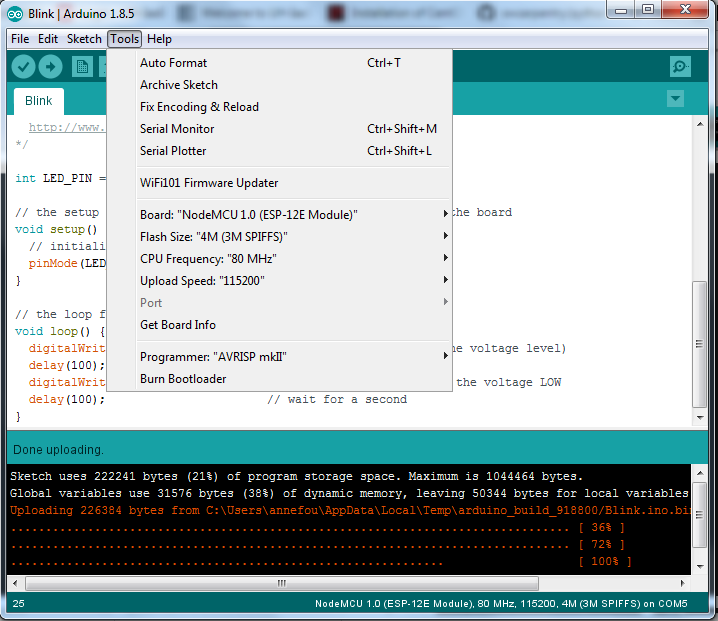

# How to install Arduino Desktop IDE?

You can use the online Arduino IDE (https://create.arduino.cc/) and for this you would need to register first. However, using the online version requires an internet connection and also may not work when using other microcontrollers (such as ESP8266, ESP32, etc.). For these reasons, we think it is important to learn to install Arduino Desktop IDE on your laptop.

1. Download Arduino Desktop IDE at [Arduino Software](https://www.arduino.cc/en/main/software#download) 
2. Choose and click on the corresponding distribution depending on your Operating System (Windows 7, Windows10, Linux 64 bits, etc.)
3. Click on "__JUST DOWNLOAD__" and follow instructions given
4. If you do not have administrator rights, download the "_Windows ZIP file for non admin install_" and unzip it to the desired location.
5. Start Arduino Desktop IDE (if it does not start automatically or you don't find the Arduino IDE shortcut, click on arduino.exe)

# How to program an Arduino Nano with Arduino GUI?

## Verify that the Arduino Nano board is functionning

- Connect the mini USB type B side of the cable to the Arduino Nano board as shown on the figure below (mind the direction of the connector!)

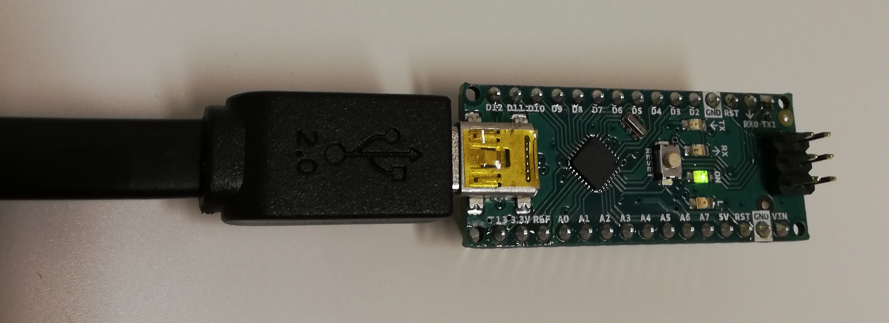

- Connect the USB type A side of the cable to your computer.
- Open tab "Tools --> Boards --> Boards Manager" and check "Arduino Nano" is available. 
- Select **Arduino Nano** board

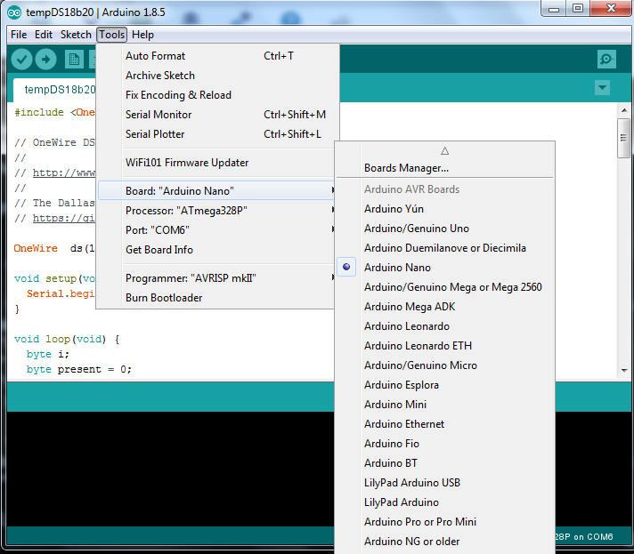

## Select __Port__

Finally you need to select the __port__ (physical USB connector on your computer) to tell the path where the board is physically plugged in your computer.

- Click on "__Tools --> Port__" and select the corresponding USB port.

- Check you have selected it: when you click again on "__Tools --> Port__", you should see a "tick" in front of your selected port (see image below):

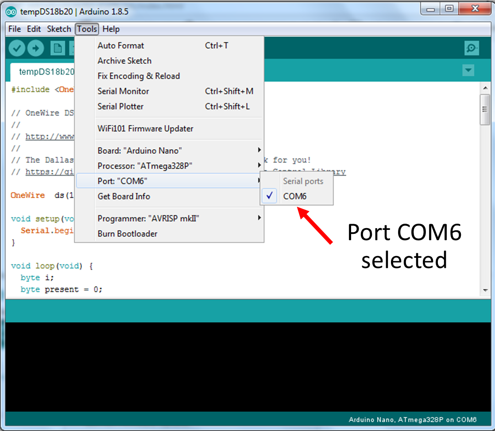

> ## Name of the port
> On a windows computer, ports are name such as "COM3", "COM5", "COM6", etc. but the naming convention is different on Linux or Mac OSX
>
{: .callout}

## Run our very first program

As our very first program, we will blink the built-in led.

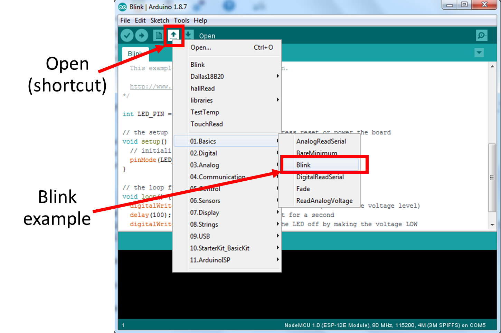

- You should have a code called "Blink" in your Arduino Deskop IDE. 
- It uses predefined variables such as **LED_BUILTIN** to switch on and off the built-in led
- Change the delays (first to 2000 and then 1000):

~~~
/*
  Blink

  Turns an LED on for one second, then off for one second, repeatedly.

  Most Arduinos have an on-board LED you can control. On the UNO, MEGA and ZERO
  it is attached to digital pin 13, on MKR1000 on pin 6. LED_BUILTIN is set to
  the correct LED pin independent of which board is used.
  If you want to know what pin the on-board LED is connected to on your Arduino
  model, check the Technical Specs of your board at:
  https://www.arduino.cc/en/Main/Products

  modified 8 May 2014
  by Scott Fitzgerald
  modified 2 Sep 2016
  by Arturo Guadalupi
  modified 8 Sep 2016
  by Colby Newman

  This example code is in the public domain.

  http://www.arduino.cc/en/Tutorial/Blink
*/

// the setup function runs once when you press reset or power the board
void setup() {
  // initialize digital pin LED_PIN as an output.
  pinMode(LED_BUILTIN, OUTPUT);
}

// the loop function runs over and over again forever
void loop() {
  digitalWrite(LED_BUILTIN, HIGH);   // turn the LED on (HIGH is the voltage level)
  delay(100);                       // wait for a second
  digitalWrite(LED_BUILTIN, LOW);    // turn the LED off by making the voltage LOW
  delay(2000);                       // wait for a second
}
~~~
{: .language-c++}

- Try to execute it:

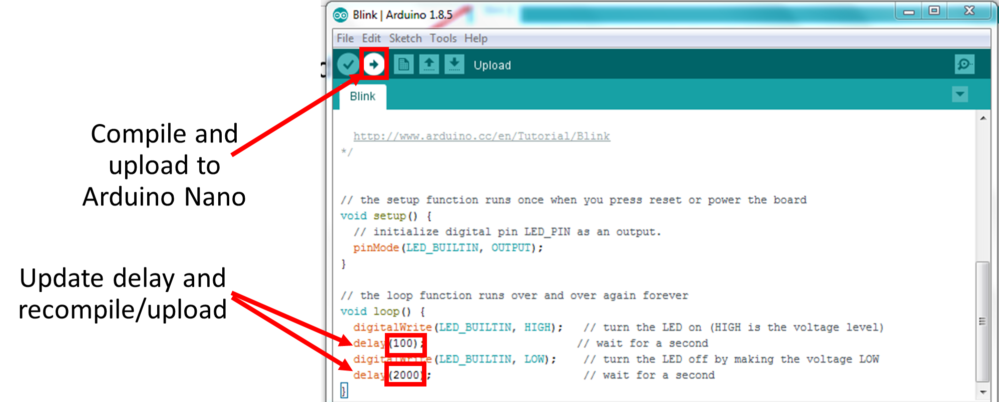

> ## Tips on Arduino Desktop IDE
> 
> 

> 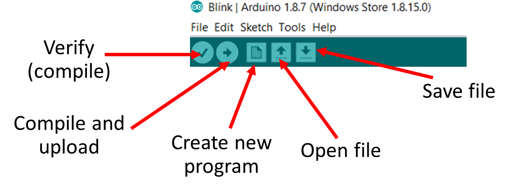     alt="Arduino IDE information"
>          height="250" />
> 

>
{: .callout}

> ## Tips on Arduino IDE language and code structure
> - Comments // (like in C++)
> - setup (void setup()) is executed once only
> - loop (void loop()) is a function that runs forever (quit arduino IDE to stop it).
>
{: .callout}


