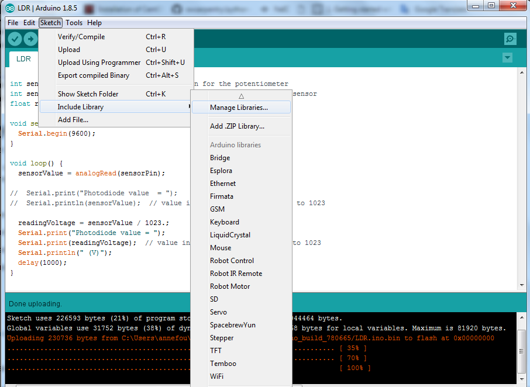

Now that your Arduino Desktop IDE and Arduino Nano are both installed and  working on your laptop, we can start to add an external sensor and control it via a program.

## Using Input/Output on Arduino Nano

Before using an available Inputs/Outputs from our Arduino Nano board, let's have a look at them:

- __Vin__ to supply power to the Arduino Nano (as a standalone device, without your laptop)
- __GND__ Ground pins all connected together and serve as a 0V reference
- __ADC__ Input for the built-in analog to digital convert 
- __AX__ are analog inputs and outputs pins 
- __DX__ are digital inputs and outputs pins (some of them can be modulated for outputs)

# LDR 

We will add a Light Dependent Resistor (LDR) to sense light levels, measure those levels with the Arduino Nano and print the measurements to the Serial port.

Arduino Nano measures Voltages on pins A0 to A5; but the LDR is a variable resistor (varying with Light). So we need to convert the varying resistance to a voltage that the Arduino iNano can measure.

We do that by using the LDR and a Resistor in a [Potential Divider circuit](https://en.wikipedia.org/wiki/Voltage_divider).

Use the breadboard and the wires to connect the resistor, the LDR and the Arduino Nano together as follow:

- Bend (gently) the 2 legs of the resistor (to make a U) and place it on the breadboard on two parallel rows; 

One leg of the LDR is connected to VCC (5V) on the Arduino Nano, and the other to the analog pin 0 (A0) on the Arduino Nano. A 2.2 kOhm resistor is also connected to the same leg and grounded.

> ## Tips for the breadboard
>
> Breadboards consist of tiny "holes" in which the leads of the component connect into. 
> 

>       alt="breadbord"
>          height="400" />
> 

> 
> But holes are not all connected to each others.
>
> 

>       alt="breadbord connections"
>          height="400" />
> 

> More information can be found [here](https://learn.sparkfun.com/tutorials/how-to-use-a-breadboard)
>
{: .callout}

### Measure light levels with an Arduino Nano

Create a new sketch (New button) and paste the following code:

~~~
int sensorPin = A0; // select the input pin for LDR

int sensorValue = 0; // variable to store the value coming from the sensor

void setup() {
Serial.begin(9600); //sets serial port for communication
}

void loop() {
sensorValue = analogRead(sensorPin); // read the value from the sensor
Serial.println(sensorValue); //prints the values coming from the sensor on the screen

delay(100);

}
~~~
{: .language-bash}
 
As before you can recognize the two main parts of the program:

- setup() that is run once only
- loop() that is run in loop (never stops).

To run it:

- **Check your electronic circuit before running your programm**.
- Connect your Arduino Nano to the USB port of your laptop
- Select Arduino Nano board (if not done yet) and the right USB port
- Upload program to the Arduino Nano

In the program above, we use a new built-in object called __Serial__ to communicate with the serial port. We set its speed to 9600 baud (so you also need to adjust the speed of the serial port in the Arduino IDE).

To see the values written on the serial port, open the tab "Tools --> Serial Monitor":

Then make sure, you set the speed of the serial port to 9600 (same value as in your program).
You should then see the raw values printed in a this new window:

### Make a plot 

Close the Serial Monitor and then open the Serial Plotter (Tools --> Serial Plotter).

You should see a plot as shown below.

So far, we printed and plotted raw values only. We can scale these raw values:

~~~
int sensorPin = A0; // select the input pin for LDR

int sensorValue = 0; // variable to store the value coming from the sensor
float readingVoltage;

void setup() {
Serial.begin(9600); //sets serial port for communication
}

void loop() {
sensorValue = analogRead(sensorPin); // read the value from the sensor
readingVoltage = sensorValue* 3.3/1023; // we have 10 bits precision (1^10 = 1023)
                                        // and 3.3V as voltage input for analog to 
					// digital convertor
Serial.println(readingVoltage); //prints the values coming from the sensor on the screen

delay(100);

}
~~~
{: .language-bash}

## DS18b20 information

## Connect a DS18b20 to our Arduino Nano

We will add our [DS18b20](https://datasheets.maximintegrated.com/en/ds/DS18B20.pdf) to the previous circuit. For now our LED will blink independently from our temperature sensor. Later, we will add a LDR and switch on the LED at "night".

- First **disconnect** your Arduino Nano from your computer

- As for the LED, we need to add a __resistor__ in order to pull down the voltage to 0 and allow the sensor to send a new value.

In our example, a 4.7 kohm will be used.

- Bend (gently) the 2 legs of the resistor (to make a U) and place it on the breadboard with one leg connected to the second leg of the DS18b20 (DQ) and the other leg connected to the last leg of the DS18b29 (VDD).

- Finally connect the first leg of the DS18b20 to the ground (G), the second to 3V and the last to D5 as shown on the figure below:

## Get data from your program

In order to acquire data from the DS19b20, you need to install a new library called "OneWire" on your computer. 

- Add OneWire to your Arduino libraries (__Sketch --> Include Library --> Manage libraries__)

And then enter "OneWire" and install it as shown on the figure below:

- Download the [code](../code/DS18b20.ino) to acquire and print data from the DS18b10 thermistor

- Connect your Arduino Nano to an USB port on your computer. Check it is recognized properly.

- Compile, upload and execute the code

## Visualize data

- Tools --> Serial Monitor

It will show values as printed on a serial port in the program

- Tools --> Serial Plotter

It will plot the values. Please make sure you first close the __Serial Monitor__ before opening the Serial Plotter (both cannot work together).

In both cases, make sure you select "9600 baud".

> ## Combine both the DLR and the thermistor
>
> From the two previous program (DLR and thermistor), write
> a new program capable of measuring both the light levels and
> the temperature in degrees Celcius.
>
> __Hint__: Reuse the two previous programs we have written.
>
{: .challenge}


